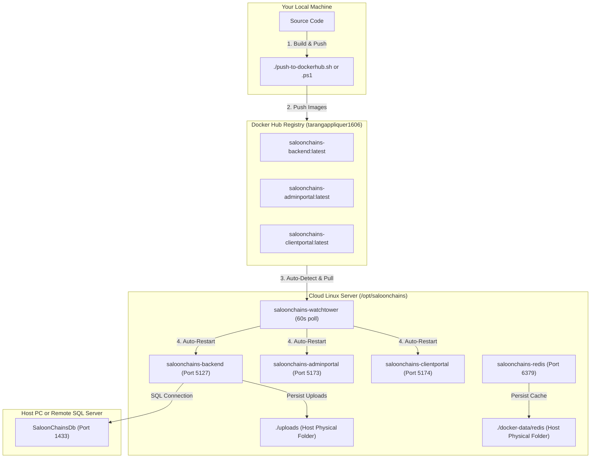

# SaloonChains Production Docker Deployment Guide

This guide provides step-by-step instructions for containerizing, building, pushing, and deploying the **SaloonChains** application stack (Backend API, Admin Portal, Client Portal, Redis Cache, and Watchtower auto-updater) to a **Cloud Linux Server** using **Docker Hub** and **Docker Compose**.

---

## 🏗️ Architecture Overview



---

## 🔑 Prerequisites & Account Setup

1. **Docker Desktop** installed on your local machine.
2. **Docker & Docker Compose** installed on your Cloud Linux server.
3. **Docker Hub Account**: `tarangappliquer1606`.
4. **Docker Hub Access Tokens (PAT)**:
   - **Local Machine**: PAT with **Read & Write** permissions (for pushing images).
   - **Cloud Linux Server** (If private repository): PAT with **Read-Only** permissions (security best practice).

---

## 💻 Part 1: Local Machine Workflow (Build & Push)

### Step 1: Log in to Docker Hub Locally
Open your local terminal and log in using your Docker Hub username and **Read & Write PAT**:

```bash
docker login -u tarangappliquer1606
```

### Step 2: Build & Push Containers to Docker Hub
Run the provided helper script to build all containers and push them to Docker Hub:

- **Windows PowerShell**:
  ```powershell
  .\push-to-dockerhub.ps1
  ```

- **Linux / macOS / Git Bash**:
  ```bash
  ./push-to-dockerhub.sh
  ```

Alternatively, run standard Docker Compose commands:
```bash
docker compose build
docker compose push
```

---

## ☁️ Part 2: Cloud Linux Server Setup (One-Time Deployment)

### Step 1: Configure Cloud Firewall / Security Group
In your cloud provider console (AWS EC2, DigitalOcean, Hetzner, GCP, Azure VM, Linode, etc.), allow incoming TCP traffic on the following ports:

| Port | Service | Description |
| :--- | :--- | :--- |
| **5127** | `saloonchains-backend` | .NET 10 Web API |
| **5173** | `saloonchains-adminportal` | Admin Portal Frontend (Nginx) |
| **5174** | `saloonchains-clientportal` | Client Portal Frontend (Nginx) |
| **6379** | `saloonchains-redis` | Redis Cache (Optional: Keep internal) |

---

### Step 2: Prepare Deployment Folder on Cloud Linux Server
SSH into your Cloud Linux server and create the deployment directory:

```bash
sudo mkdir -p /opt/saloonchains
sudo chown -R $USER:$USER /opt/saloonchains
cd /opt/saloonchains
```

---

### Step 3: Copy Configuration Files to Server
From your **local machine**, copy `docker-compose.yml` and `.env.example` to your server:

```powershell
scp docker-compose.yml .env.example user@YOUR_CLOUD_SERVER_IP:/opt/saloonchains/
```

---

### Step 4: Configure `.env` File on Cloud Linux Server
On your Cloud Linux server, copy `.env.example` to `.env` and update the environment variables:

```bash
cd /opt/saloonchains
cp .env.example .env
nano .env
```

Update `.env` with your production settings:

```env
# -------------------------------------------------------------------------
# DOCKER HUB REGISTRY USERNAME
# -------------------------------------------------------------------------
DOCKERHUB_USERNAME=tarangappliquer1606

# -------------------------------------------------------------------------
# PHYSICAL HOST FOLDERS FOR PERSISTENT DATA
# -------------------------------------------------------------------------
UPLOADS_DIR=/opt/saloonchains/uploads
REDIS_DATA_DIR=/opt/saloonchains/data/redis

# -------------------------------------------------------------------------
# DATABASE CONNECTION STRING (Targeting Host PC or Remote SQL Server)
# -------------------------------------------------------------------------
# Example for Remote SQL Server / Cloud DB:
SALOON_DB_CONN_STRING=Server=192.168.1.100,1433;Database=SaloonChainsDb;User Id=sa;Password=YourSecurePassword123!;TrustServerCertificate=True;

# -------------------------------------------------------------------------
# SECURITY CONFIGURATION
# -------------------------------------------------------------------------
JWT_SIGNING_KEY=SaloonChains_Production_Secret_Signing_Key_32_Bytes_Min
```

---

### Step 5: (Optional for Private Repositories) Log in with Read-Only Access
If your Docker Hub repository is **Private**, authenticate your server using a **Read-Only PAT**:

```bash
docker login -u tarangappliquer1606
```

Then, in `/opt/saloonchains/docker-compose.yml`, enable Watchtower to read your saved credentials by uncommenting line 97:

```yaml
  saloonchains-watchtower:
    image: containrrr/watchtower
    container_name: saloonchains-watchtower
    volumes:
      - /var/run/docker.sock:/var/run/docker.sock
      - ~/.docker/config.json:/config.json:ro  # <--- Uncomment for private repositories
    command: --interval 60 --cleanup
    restart: unless-stopped
```

---

### Step 6: Start Server Containers
Run Docker Compose on your Cloud Linux server:

```bash
docker compose up -d
```

Verify all containers are running:
```bash
docker compose ps
```

---

## 🚀 Part 3: Automated Zero-Downtime Deployment

Once set up, **you never need to SSH into your server to deploy updates**:

1. Make code changes locally.
2. Run `.\push-to-dockerhub.ps1` (or `./push-to-dockerhub.sh`).
3. All service definitions specify `pull_policy: always`, ensuring Docker always checks for and pulls updated images.
4. **Watchtower** running on your server checks Docker Hub every 60 seconds.
5. When Watchtower detects a new image push under `tarangappliquer1606/*`, it automatically:
   - Pulls the latest images.
   - Gracefully restarts `saloonchains-backend`, `saloonchains-adminportal`, and `saloonchains-clientportal`.
   - Cleans up old dangling images (`--cleanup`) to preserve server disk space.

---

## 🛠️ Useful Management Commands

| Action | Command (Run on Server) |
| :--- | :--- |
| **Pull Latest Images Manually** | `docker compose pull` |
| **Update Containers to Latest Images** | `docker compose up -d` |
| **View Live Logs** | `docker compose logs -f` |
| **View Backend Logs** | `docker compose logs -f saloonchains-backend` |
| **View Watchtower Activity** | `docker compose logs -f saloonchains-watchtower` |
| **Check Running Containers** | `docker compose ps` |
| **Restart Stack Manually** | `docker compose restart` |
| **Stop All Containers** | `docker compose down` |
